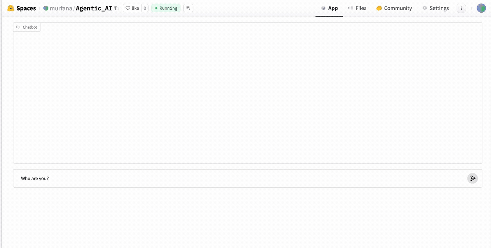
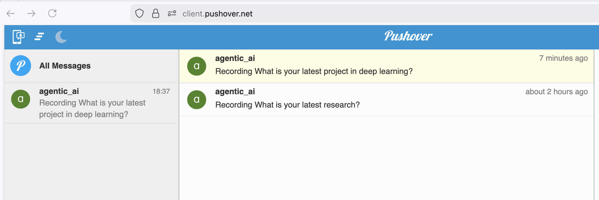

<p align="center">
<h1 align="center">AI Portfolio Agent with Gradio and HuggingFace
</h1>
</p>
<p align="center">
    
    
    
    
</p>


<p align="center">
  <br/>
  <em>Demo: AI Portfolio Agent with HuggingFace </em>
</p>


<p align="center">
<h3 align = "center"> Pushover Notification
</h3>
</p>

<p align="center">
  <br/>
  <em>Notification When Agent Unable to Answer </em>
</p>

## What's this project about?

AI Portfolio Agent acts as a representative of the portfolio's owner using data, such as personal summary and resume files, to answer questions about the owner. In this project, I use the data from our tutor and mentor, **Dr. Habib Shaikh**. Owner will aslo be notify when the agent is unable to answer.

## Features

- **Acts as portfolio's owner**: Responds to inquiries in a professional and engaging manner, representing him for interactions on his website
- **Provides career information**: Answers questions based on his LinkedIn profile and personal summary
- **Pushover Notification**: Using Pushover notification to notify owner about unaswered questions
- **Captures leads**: Records user contact information when they're interested in getting in touch
- **Tracks unanswered questions**: Logs any questions it cannot answer for follow-up
- **Web interface**: Offers an easy-to-use chat interface built with Gradio


## Tech Stack

### **Core Libraries & Frameworks**

- **Python**: Primary programming language for the application
- **Gradio**: Framework for creating the web interface and chat UI
- **OpenAI**: GPT-4o-mini model for natural language processing and conversation

### **Data Processing & File Handling**

- **PyPDF**: Library for extracting text from PDF files (LinkedIn profile)
- **dotenv**: Manages environment variables and API keys securely

### **APIs & External Services**

- **Pushover API**: Sends notifications for user interactions and unanswered questions
- **Requests**: HTTP library for making API calls to Pushover

### **Deployment & Hosting**

- **Hugging Face Spaces**: Platform for deploying and hosting the Gradio application

### **Data Sources**
- **PDF Files**: LinkedIn profile data extracted from `Profile.pdf`
- **Text Files**: Personal summary from `personal_summary.txt`


## Setup Guide

### Prerequisites
- Python 3.8 or higher
- OpenAI API key
- Pushover account (for notifications - optional)
- Hugging Face account (for deployment)

### Create a virtual environment and install dependencies

Using `venv`:
```bash
python3 -m venv .agvenv
source .agvenv/bin/activate
```

### Install requirements

```bash
pip install -r requirements.txt
```

### Create an .env file to store all the keys

```bash
OPENAI_API_KEY=your_openai_api_key_here
PUSHOVER_TOKEN=your_pushover_token_here 
PUSHOVER_USER=your_pushover_user_key_here
USER_EMAIL=your_pushover_user_email
HF_TOKEN=your_huggingface_token
```

### Run app.py with Gradio

```bash
python app.py
```


### Deployment to Hugging Face

#### 1. Create a Hugging Face Space

- Go to huggingface.co/spaces
- Click "Create new Space"
- Select "Gradio" as the SDK
- Choose a name for your space

### 2. Create HuggingFace token
- Go to Access Token
- Create new token
- copy the token and paste onto your `HF_TOKEN` in `.env` file


#### 3. Deploy Gradio with HuggingFace

- On your terminal, write this code:

```bash
gradio deploy
```

- Provide all the secret names and secret keys.
- Once successful, it will provide a sharable link with UI that user can chat with the agent.